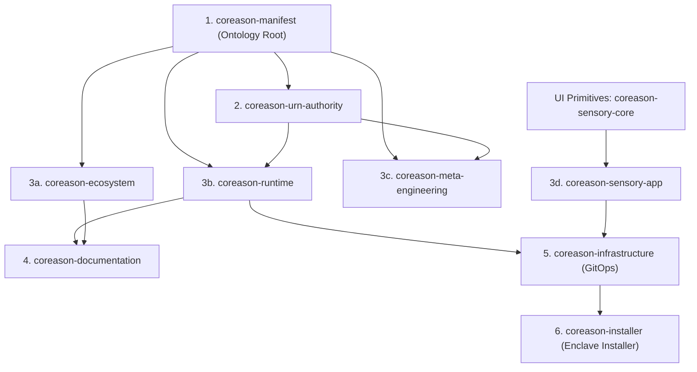

# CoReason Coordinated Release Guide

This document describes the standardized, multi-repository release process for the CoReason suite of packages. It applies to all developers and AI agents working within this workspace.

---

## 1. Release Architecture & Dependency DAG

Because of Python package dependencies and lockfile requirements, releases must propagate down the directed acyclic graph (DAG) below:



### Topological Cascade Rules:
1. **Upstream First:** A change to `coreason-manifest` must be merged, tagged, and published first.
2. **Propagate Dependency Pins:** Downstream repositories must have their version pins updated (in `pyproject.toml` or `package.json`), their lockfiles compiled, and committed before they can be released.

---

## 2. Versioning & Hook Validations

### Version Schemes:
*   **VCS-Dynamic (Hatch/Python):** All Python packages (`coreason-manifest`, `coreason-urn-authority`, `coreason-runtime`, `coreason-ecosystem`, `coreason-meta-engineering`, `coreason-documentation`, `coreason-infrastructure`, `coreason-isv-admin`, `coreason-installer`) resolve their versions dynamically from Git tags using `hatch-vcs`. They retrieve version at runtime using `importlib.metadata` with fallback `"0.0.0-dev"`.
*   **VCS-Dynamic (NPM/Node):** NPM packages (`coreason-sensory-app`, `coreason-sensory-core`, and `coreason-sensory-embed`) specify version `"0.0.0-dev"` in `package.json` in Git. The release/publishing workflows dynamically inject the tag version (e.g. `vX.Y.Z`) at build/publish time.

### Git Verification Hooks:
To prevent CI publish failures, standard git hooks run automatically on:
1. **Pre-commit:** Ensures static files conform to expected version declarations.
2. **Pre-push:** Rejects tag pushes if the tag `vX.Y.Z` does not match the SemVer format. For any static package files (if any are left static), it ensures tag version matches package version.

---

## 3. Coordinated Release Pipeline

The release process integrates local verification with cloud-based continuous delivery:

```
[Developer updates coreason-manifest]
             |
             v
1. [Local Helper CLI] --------> Updates dependency version pins, compiles lockfiles,
                                and bumps static package files topologically.
             |
             v
2. [Release Please (Cloud)] --> Evaluates Conventional Commits, maintains CHANGELOG.md,
                                drafts "Release PRs", and creates Git tags on PR merge.
             |
             v
3. [Publish Workflow (CI)] ---> Builds PyPI/NPM packages and Docker containers.
             |
             v
4. [GitOps Promotion (CD)] ---> Triggers a Repository Dispatch payload to Argo CD configurations
                                in `coreason-infrastructure` to roll out new container tags.
```

---

## 4. OCI Artifacts, Cloud Marketplaces, and GitOps

To support automated, secure deployments across cloud substrates and developer sandboxes, the release pipeline publishes and verifies the following target artifacts:

### A. OCI Container Images
- **GitHub Container Registry (GHCR):** All components are packaged as Docker-compatible OCI images under `ghcr.io/coreason-ai/`.
- **Cosign Cryptographic Signing:** Every container image is signed via keyless **Sigstore/Cosign** to guarantee supply chain integrity.
- **SLSA Level 3 Provenance:** GitHub Actions generates SLSA build provenance and publishes it via GitHub Attestations.
- **Dynamic Tagging:** Images are published with both the explicit tag (`vX.Y.Z`) and the `:latest` tag to support automatic updates in tracking environments.

### B. OCI Helm Charts
- **Infrastructure Packaging:** Helm charts (e.g., `coreason-enterprise` and `coreason-mesh`) are packaged and pushed as OCI artifacts to `ghcr.io/coreason-ai/charts/`.
- **Signature Verification:** Production Kubernetes clusters must verify Helm chart signatures before deployment:
  ```bash
  cosign verify ghcr.io/coreason-ai/charts/coreason-enterprise:vX.Y.Z
  ```

### C. Cloud Marketplace AMIs & Terraform
- **Topology-in-a-Box:** All dependencies are bundled into an orchestrated, self-bootstrapping enclave for push-button deployment on AWS ECS/Fargate or Azure Container Instances.
- **Packer Pipelines:** Pre-baked AMIs containing the systemd `coreason.service` are built via Packer (`infrastructure/packer/aws/topology-in-a-box.pkr.hcl`) to pull the latest signed containers on boot.
- **Terraform IaC:** Infrastructure templates are stored in `coreason-ecosystem/infrastructure/terraform/aws/` to automate provisioning VPCs, IAM task roles, and clusters.

### D. GitOps Promotion (ArgoCD)
- **Repository Dispatch:** Once new images are published to GHCR, the workflow sends a dispatch payload to `coreason-infrastructure`.
- **ArgoCD Reconciliation:** ArgoCD automatically updates the targeting manifests to sync the new release tags and roll out updates using sync wave orchestration.

### E. Swarm-in-a-Box / Enclave Packaging
- **Local Dev/Test E2E Swarm:** The full Tripartite Swarm (Gateway, Runtime/WASM Sandbox, URN Authority, Asset Forge) is orchestrated locally via `docker-compose.e2e.yaml` under `coreason-ecosystem/tests/e2e_swarm/` in accordance with the anti-mocking, real-test mandate.
- **Enterprise Single-Enclave ("Swarm-in-a-Box"):** Standalone, single-host virtual machine image or container set that boots all Tripartite planes in isolation.
- **Deprecation of Federated Swarm-in-a-Box:** The decentralized/federated multi-host data models (previously detailed in Challenge X23) are officially deprecated under the **Absolute Type Isomorphism** invariant. All downstream enclaves must remain purely anemic and tightly isomorphic to the Python data plane (`coreason_manifest.spec.ontology`) to preserve zero-trust verification boundaries. Only single-enclave Swarm-in-a-Box configurations are supported.

---

## 5. Release Orchestration Commands

Use the central workspace release manager to run coordinated tasks:

*   **View global status and check mismatches:**
    ```bash
    python scripts/release_helper.py --status
    ```
*   **Bump package versions locally:**
    ```bash
    python scripts/release_helper.py --bump [major|minor|patch] --repo <repo-name>
    ```
*   **Tag a local repository version (checks version matches first):**
    ```bash
    python scripts/release_helper.py --tag <version> --repo <repo-name>
    ```

    > [!IMPORTANT]
    > **Release Please (Release Me) Only:** `coreason-infrastructure` uses Release Please exclusively for release orchestration. Direct local tag creation via the helper CLI and direct tag pushes to origin are blocked. Releases for this repository must be triggered by merging a Release Please PR.

---

## 6. Agent Boundary Constraints

AI agents operating in this workspace must strictly adhere to the following safety rules:

1.  **No Direct Registry Publishes:** Do not run commands that upload packages or images directly to registries (e.g. `npm publish`, `cargo publish`, `docker push`, `pypi publish`). All publishes must go through GitHub Actions triggered by tag merges.
2.  **No Direct Workflow Modifications:** Do not modify `.github/workflows/` scripts unless specifically directed and approved.
3.  **Strict Commit Conventions:** Use conventional commit formats (`feat(...)`, `fix(...)`, `chore(...)`) for all code modifications.
4.  **Enforce Release Please for Infrastructure:** Do not attempt to bypass `release-please` for `coreason-infrastructure`. Any release tag must be generated via a merged Release Please pull request.
